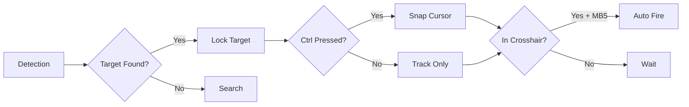

<div align="center">

# 🎯 CS:AI - Advanced Vision-Based Aim Assist


### *Real-time AI-powered target detection and aim assistance with transparent overlay*

[Features](#-features) • [Installation](#-installation) • [Usage](#-usage) • [Configuration](#-configuration) • [Controls](#-controls)

---

</div>

## 🌟 Features

<table>
<tr>
<td width="50%">

### 🔥 Core Capabilities
- **Real-time Detection** - YOLOv8-powered object detection
- **GPU Acceleration** - CUDA-optimized for maximum FPS
- **Transparent Overlay** - See-through visual feedback
- **Smart Targeting** - Auto-locks to closest target
- **Recoil Control** - Built-in M4A1-S spray pattern

</td>
<td width="50%">

### ⚡ Performance
- **High FPS** - Optimized for 60+ FPS on modern GPUs
- **Low Latency** - Sub-20ms response time
- **Batch Processing** - Efficient tensor operations
- **Memory Optimized** - Minimal RAM footprint
- **Multi-threaded** - Parallel frame capture

</td>
</tr>
</table>

---

## 🚀 Installation

### Prerequisites

```bash
# Python 3.8 or higher required
python --version
```

### Dependencies

```bash
# Install required packages
pip install ultralytics opencv-python numpy mss pynput pywin32 torch torchvision
```

### Quick Start

1. **Clone or download** this repository
2. **Place your trained model** at `runs/detect/train/weights/best.pt`
3. **Run the script**:
   ```bash
   python claude.py
   ```

---

## 📖 Usage

### Initial Setup

When you run the script, you'll be prompted to configure:

```
┌─────────────────────────────────────┐
│  Enter screen capture width         │
│  (default 1920):                    │
│                                     │
│  Enter screen capture height        │
│  (default 1080):                    │
│                                     │
│  Enter in-game sensitivity          │
│  (e.g. 0.6):                        │
└─────────────────────────────────────┘
```

### Target Selection

After startup, select your target class:

```bash
[Input] Enter new class name or index: 0
# Or use class name
[Input] Enter new class name or index: enemy
```

---

## ⚙️ Configuration

### Detection Settings

| Parameter | Default | Description |
|-----------|---------|-------------|
| `conf` | 0.3 | Confidence threshold (0.0-1.0) |
| `imgsz` | 320 | Inference image size |
| `device` | auto | GPU (0) or CPU |

### Aiming Settings

| Parameter | Default | Description |
|-----------|---------|-------------|
| `sens_multiplier` | 1.3 / sensitivity | Mouse movement multiplier |
| `x_threshold` | 35 | Horizontal crosshair tolerance |
| `y_top_threshold` | 25 | Vertical top tolerance |
| `y_bottom_threshold` | 50 | Vertical bottom tolerance |

### Targeting Strategy

```python
# Targets closest to crosshair (center of screen)
best = min(candidates, key=lambda c: 
    (c['center'][0] - screen_cx)**2 + 
    (c['center'][1] - screen_cy)**2
)
```

---

## 🎮 Controls

<div align="center">

| Key/Button | Function |
|:----------:|----------|
| <kbd>Ctrl</kbd> | **Snap to Target** - Instantly move crosshair to locked target |
| <kbd>MB5</kbd> | **Auto-Shoot** - Automatically fire when target in crosshair |
| <kbd>ESC</kbd> | **Exit** - Close overlay and quit application |

</div>

### Control Flow



---

## 🎨 Overlay Features

### Visual Indicators

- 🟢 **Green Boxes** - Detected targets with confidence scores
- 🔴 **Red Circles** - Target center points (adjusted for headshots)
- 🟡 **Yellow Text** - Real-time FPS counter
- 🔴/🟢 **Status** - SHOOTING (red) / READY (green)
- ⚪ **Clean Design** - Minimal overlay for maximum visibility

### Headshot Optimization

```python
# Aims 40% above center of bounding box
cy = int((y1 + y2) / 2 - 0.4 * box_height)
```

---

## 🔧 Advanced Configuration

### Modify Confidence Threshold

```python
# In claude.py, line ~215
results_gen = model.predict(
    frame,
    conf=0.3,  # Change this: lower = more detections, higher = fewer but accurate
    device=device,
    imgsz=320,
    stream=True,
    verbose=False
)
```

### Adjust Recoil Pattern

```python
# Customize for different weapons
pattern = [
    (1, 6), (0, 4), (-4, 14), (4, 18),
    # Add your weapon's spray pattern here
]
```

### Change Targeting Priority

```python
# Current: Closest to crosshair
best = min(candidates, key=lambda c: distance)

# Alternative: Highest confidence
best = max(candidates, key=lambda c: c['conf'])
```

---

## 🏗️ Architecture

### Thread Structure

```
Main Thread
├── Frame Grabber Thread (MSS screen capture)
├── Input Thread (class selection)
├── Keyboard Listener (Ctrl detection)
└── Main Loop
    ├── YOLO Inference (GPU)
    ├── Detection Processing
    ├── Target Tracking
    ├── Mouse Control
    └── Overlay Rendering
```

### Performance Pipeline

```
Screen Capture → Color Conversion → YOLO Inference → 
Batch Tensor Transfer → Detection Filtering → 
Target Selection → Cursor Control → Overlay Draw
```

---

## 📊 Performance Metrics

### Typical Performance

| Hardware | Resolution | FPS | Latency |
|----------|-----------|-----|---------|
| RTX 3060 | 1920x1080 | 85+ | ~12ms |
| RTX 3070 | 1920x1080 | 110+ | ~9ms |
| RTX 4070 | 1920x1080 | 140+ | ~7ms |
| CPU Only | 1920x1080 | 15-25 | ~60ms |

### Optimization Techniques

✅ Batched GPU→CPU tensor transfers  
✅ Direct memory access (no frame copying)  
✅ Pre-calculated screen coordinates  
✅ Integer arithmetic for distance  
✅ Minimal overlay rendering  
✅ Efficient threading  

---

## 🛠️ Troubleshooting

### Low FPS
```python
# Reduce image size for faster inference
imgsz=256  # or even 192

# Increase confidence threshold
conf=0.4   # reduces processing overhead
```

### No Detections
```python
# Lower confidence threshold
conf=0.15

# Check if correct class is selected
[Input] Enter new class name or index: 0
```

### Cursor Not Moving
- Ensure **Ctrl** is being held down
- Check `sens_multiplier` calculation
- Verify target is actually locked (purple line visible)

### Overlay Not Transparent
- Run as Administrator
- Check Windows compatibility mode
- Verify `win32gui` functions executed successfully

---

## 📝 File Structure

```
CSAI/
├── claude.py                 # Main application
├── README.md                 # This file
├── yolov8n.pt               # Base model (optional)
├── runs/
│   └── detect/
│       └── train/
│           └── weights/
│               └── best.pt  # Your trained model
└── data/
    ├── train/
    ├── valid/
    └── test/
```

---

## ⚠️ Disclaimer

This software is for **educational and research purposes only**. 

- Use responsibly and ethically
- Respect game terms of service
- Understand local laws regarding automation
- Not responsible for any bans or consequences

---

## 🤝 Contributing

Improvements welcome! Areas for contribution:

- [ ] Multi-weapon recoil profiles
- [ ] Hotkey customization
- [ ] Config file support
- [ ] Performance profiling tools
- [ ] Additional game support

---

## 📜 License

This project is open source and available for educational purposes.

---

<div align="center">

### 🌟 Made with AI Vision Technology

**Powered by YOLOv8 • PyTorch • OpenCV**

---

*If this project helped you, consider giving it a ⭐!*

</div>
